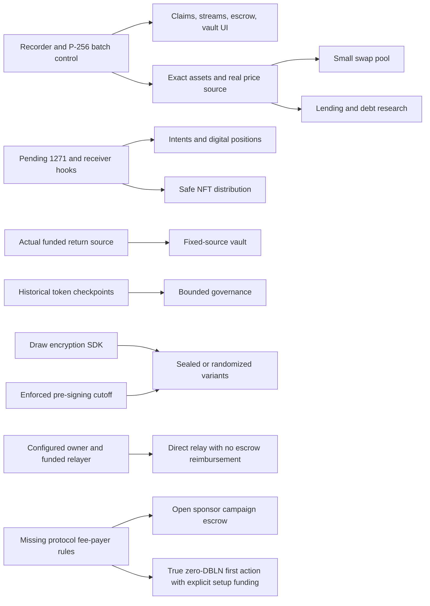

# Implementation order: three lanes, user tasks first

2026-10-06. This is a handoff to future coders, **not authorization or evidence of implementation in this revision**. No Solidity, node changes, deployment, push or runtime benchmark is part of the design commit. Scope choices follow [PROBLEMS.md](PROBLEMS.md); accounting and capability truth follow [PRIMITIVES.md](PRIMITIVES.md); all comparative claims follow [MEASUREMENTS.md](MEASUREMENTS.md).

## Before the first native contract

1. Freeze a benchmark **new-genesis** configuration with B5 active; pin node working bytes, compiler settings, wallet/account runtime and original source/chain versions. Legacy 7780 is an additional compatibility test, not the paid-state control. Verify opcode/precompile/hash/prove-gas limits rather than trusting the conflicting old execution paragraph.
2. Implement the shared result recorder around the existing real-executor harness: exact unit meter, envelope/receipt/canonical-block deltas, occupied slots/accounts, code bytes, complete user signature counts, failures and exits. No new contract can publish only a Foundry gas number as an EastSea cost.
3. Agree the local deterministic brake interface and each predicate/latch/exit specification. Pin a content hash for the brake document in future manifests. No central guardian or protocol-wide override is created. The registry interface itself is still proposed.
4. Verify real P-256 self batches and added-owner relays with budgets/reverts before any signed-intent work. Confirm account-bound 1271 behavior and NFT receiver hooks only after that separate node/account lane lands. Record deployed code hashes, not just source-function names.
5. Make the cold first-use flow visible: balance-zero funding, fresh sender/holder costs, owner setup, native-vault quorum setup, guardian backup and data export. Improve wallet payments/names/recovery using existing authority before adding new custody contracts.

## Gate register: do not assume these exist

| Gate | Required work | Current state / owner / consumers |
|---|---|---|
| G0 | Exact executor/genesis/fee-vector recording and original pins, licence checks and fairness of workload | **NOT YET RUN for native designs.** Lane A owns shared recorder; all lanes own their original pins and runs. |
| G1 | Account ERC-1271 P-256 validation with account/chain/action binding; malformed signature, old owner and cross-account replay cases | **PENDING external account implementation.** Node/account engineers own it; Lane A validates deployment. Blocks maker-authorized quoted RFQ, delegated intents, signature-based listings and relayed typed votes; an AMM self-batch is a separate earlier control. Inventory allowance is not maker price consent. Do not assume EIP-2612 changes. |
| G2 | ERC-721 and ERC-1155 receiver hooks on actual delegated account runtime | **PENDING external account implementation.** Required for safe NFTs/positions, ERC-1155 predictions and relevant marketplace paths. Test single/batch receive and retain safe-transfer semantics. |
| G3 | Draw-timelock SDK: MinSig/TLE compatibility, exact namespace/message/hash-to-curve suite, fixed group key across reshare, canonical ciphertext format, authenticated raw seed delivery and availability | **SDK NOT IMPLEMENTED.** Lane A owns bounded app-side feasibility/SDK design; external node team confirms API/public-key invariance. Wallet encrypt/decrypt automatically; user sees deadline/refund/wait. No one-second opening promise. |
| G4 | Enforceable cutoff before the relevant draw can be signed; trustworthy draw/epoch mapping and verifiable complete bounded clearing/selection | **NOT IDENTIFIED as a usable EVM interface.** External protocol/node team must specify authenticated metadata/proof adapter and audit honest/early signing model. Lane B cannot replace it with `randomness(epoch)==0`, a trusted sequencer, or a settlement root. Strong encrypted/randomized fairness is blocked. A proof adapter may suffice; if new certified metadata/signing schedule is needed, it is a protocol upgrade. |
| G5 | Open sponsor campaign escrow, public caps, complete attempt cost/solvency and funder-refund rules | **DESIGN ONLY, BLOCKED ON G6.** Lane A; Track A's already-added-owner funded relay has no escrow reimbursement. Initial native fee funding/owner setup remains explicit. No ordinary EVM contract can claim access to runtime fee settlement. |
| G6 | Alternate fee-payer reservation, authentication, balance/cap accounting, failures/refunds, admission/FOCIL/execution/proving replay and versioned envelope | **PROTOCOL UPGRADE NOT PRESENT.** External node/protocol lane owns implementation. A `sponsor` field in a survey is not a signed consensus API. Zero-DBLN onboarding is blocked until this or another verified pre-funding path exists. No commitment to burn-funded subsidy or default registrar eligibility. |
| G7 | App-bound sub-accounts/arbitrary-call permissions with selector/asset/recipient/per-action/daily caps, nonce, expiry and revoke-all | **ACCOUNT/WALLET CHANGE NOT PRESENT.** External account team; Lane A specifies integration. Existing payment sessions cannot authorize swaps, claims, votes or arbitrary dApp calls. Do not broaden them by reusing the same payment signature domain. |
| G8 | Real available assets and prices: exact transfer, issuer/bridge trust, immutable report source, observed age/confidence, commercial access and chain verification | **DATA/ECONOMIC DEPENDENCY NOT ESTABLISHED.** Lane C. Local mock feeds are useful tests, never a live market or a proved DBLN/USD oracle. Stablecoin support and Pyth availability must be independently verified. |
| G9 | Authenticated historical voting weights, bounded checkpoint growth, snapshot clock and source liveness | **ASSET/CONTRACT DEPENDENCY.** Lane A governance; a generic ERC-20 balance mapping is insufficient. Price checkpoint state separately. |
| G10 | Historical receipt evidence verifier for EVM or autonomous internal-event resolution | **NOT IDENTIFIED.** Clients already have committee-certified receipt verification; external protocol/SDK team owns any contract verifier/proof adapter. Current receipts are outside the guest proof statement. No contract may trust arbitrary uploaded logs. |
| G11 | Contract-callable native staking, reward attribution, exit queue/slashing and conservation semantics | **PROTOCOL SUPPORT ABSENT.** External protocol research, no promised implementation date. Do not substitute Mac node rewards or a mock source for real DBLN staking. |
| G12 | App registry deployment, manifest/brake schema conformance, isolated origins and publisher-update checks | **DESIGN/PRODUCT INTEGRATION GATE.** Lane A plus external wallet/registry team. A manifest is not an audit, central endorsement or execution approval. |

Additional protocol ideas **not required for the first funded consumer templates**: height-scheduled key release/encrypted mempool, transfer-reserved capacity, local hot-key fee markets and a revocable root-account model for stolen-key recovery. Each needs an explicit protocol design/version activation if pursued. No lane silently installs any of them as a contract helper.

## Lane A: authority, funding and collective control

**Owns:** shared measurement/manifest/brake integration; wallet recipes, local evidence verification, names/recovery integration; [sponsorship](sponsorship/DESIGN.md), [treasury](treasury/DESIGN.md), [governance](governance/DESIGN.md). The node's account/fee-payer implementation remains externally owned. Changes to shared schemas need agreement before other lanes consume them.

| Order | Deliverable for a person | Prerequisites / acceptance |
|---|---|---|
| A0 | Recorder + deterministic brake semantics + actual batch/receipt evidence | G0; all action and revert costs reproducible. Test wallet disappearance and history-data export. |
| A1 | Send/pay/recover/use a name with existing account features | Existing A1–A3/N1/L1 capabilities; correct zero-balance funding and original-key theft limitation. Counts include guardian/session provisioning; no new app state for contacts. |
| A2 | Treasury approve/cancel/execute with readable local effects | Existing vault baseline; measure its queue/era cleanup and original Safe with equivalent P-256 batch control. No new code if wallet changes solve the chosen task. |
| A3 | Funded app relays for already-configured owners; later open campaign escrow | Current Track A has no contract reimbursement. Track B requires **G5+G6**; caps, refusal/failure costs and funder shares are bounded. G1 only where the chosen authorization path uses 1271. |
| A4 | Bounded authenticated vote and execution | G9; G1 for signed vote path, otherwise direct account call; queue/brake paths and historical checkpoint costs proved. |
| A5 | Draw SDK feasibility and true native sponsorship interface handoff | G3/G4/G6; document protocol gates before coding dependent market features. No rollout date inferred from “SDK requires no consensus change”. |

Exit criterion: a person can independently inspect and perform each funded authorization task with no founder service; original comparisons include all setup and underlying account storage.

## Lane B: funded obligations and distribution

**Owns:** [claims](claims/DESIGN.md), [streams](streams/DESIGN.md), [escrow](escrow/DESIGN.md), [fair distribution](fair-distribution/DESIGN.md), [fair launch](fair-launch/DESIGN.md), [prediction markets](prediction-markets/DESIGN.md); campaign/obligation wallet screens. No custody-module or account-permission edits outside the lane's interfaces.

| Order | Deliverable for a person | Prerequisites / acceptance |
|---|---|---|
| B0 | Claim a fixed allocation with a provable recipient and retained replay protection | A0; leaf/root data replicated or client export; fresh-holder units measured; original bitmap comparison and expired campaign cleanup. |
| B1 | Claim already-funded earned/vested pay | A0/A1; bounded schedule, no per-second transaction, correct rounding/cancellation/beneficiary rights. No auto-payment promise based on an unfunded sponsor. |
| B2 | Fund, accept, release or refund a bounded obligation | A0/A1; disappeared counterparty, failed transfer, deadline and dispute policy explicit. Compare digital atomic settlement separately from physical delivery arbitration. |
| B3 | Receive a deterministic limited edition without silent mint failure | G2; no bot-tax penalty disguise; ownership and per-holder/claim costs included. Cannot call a per-account limit a per-person limit. |
| B4 | Complete a finite token sale or obtain a specified refund | G2 only for NFT/position receipts if used; G8 exact assets and prices as applicable; checked caps/price/graduation accounting. Public fixed-price variant is a limited product, not proved fair discovery. |
| B5 | Experiment with sealed/randomized sale or allocation | **Blocked on G3+G4**, data completeness and bounded on-chain selection/clearing. No fallback that switches after commitments to a predictable/organizer-controlled seed. Refund on unavailable prerequisite/seed without forfeiting valid claim rights. |
| B6 | Split/merge/redeem a bounded binary outcome | G2, real resolver chosen by users, funding and void semantics; signed exchange path needs G1. Real-world truth source remains an independent trust dependency. Autonomous receipt-event variant needs G10. |

Exit criterion: every live right has an owner and bounded completion/expiry policy; abandoned state is priced, and deletion cannot resurrect old claims/signatures. No money is released merely because a log or unverified aggregate root exists.

## Lane C: prices, liquidity and credit

**Owns:** [oracle](oracle/DESIGN.md), [swap pool](swap-pool/DESIGN.md), [intent exchange](intent-exchange/DESIGN.md), [lending](lending/DESIGN.md), [yield vault](yield-vault/DESIGN.md), [stable value](stable-value/DESIGN.md); price/quote/liquidity integration. No new data service is called trustless simply because anyone can relay its signed reports.

| Order | Deliverable for a person | Prerequisites / acceptance |
|---|---|---|
| C0 | Reproducible token/feed probes and economic simulation | A0, G8; balance deltas, frozen/rebasing/fee tokens, genuine observations, stale/withheld reports; stable asset and commercial data access recorded. |
| C1 | Small permissionless pool with bounded exact constraints | A0/A1, exact assets; no oracle dependency for ordinary swaps. Compare V2, V3/V4/StableSwap advantages separately; measure deployment and fresh LP holders, contention and public inclusion MEV. |
| C2 | Quote/limit execution without permanent resting orders | **Both RFQ and delegated modes require G1** for maker/user consent; C1 AMM self-batch is the earlier control. No privileged settlement bot, replay gap or incorrect partial-fill claim. Include original UniswapX/CoW with same account benefits. |
| C3 | Isolated collateral-backed borrow/repay/exit | C0/G8 and actual funded liquidity; fixed rates/policy, stale-price response, bad debt/rounding and liquidator liveness. Refunds/withdrawals obey solvency; no global admin freeze. |
| C4 | Fixed-source pooled return, only if wrapper adds value | Verified funded source; donation/rounding, source withdrawal delay/default and all inherited costs/fees. G11 is **not supplied**: generic vault work does not establish native liquid staking. Wallet reuse wins if extra wrapper solves nothing. |
| C5 | Experimental collateral debt and peg investigation | C0/C3 and actual DBLN observation, available collateral, redemptions and market-depth evidence. No stable-value claim from unit denomination alone; no central reserve/curation/fee recipient. |

Exit criterion: each price/quote has explicit selected trust and freshness; the person sees losses/waiting/liquidity constraints; no unsupported asset or mock price leaks into a production comparison.

## Dependency graph

Graph arrows are release dependencies, not an assertion that any missing box is implemented. Pool swaps do not use an external price feed; credit does. Oracle freshness and native staking are deliberately separate from the consensus beacon.

## Integration and live-budget scheduling

- Run each item in the original compatibility control and the real native executor. Native implementation stays separate from vendored originals; licence boundaries and source fidelity belong to the original track.
- Every PR includes final storage layout and per-action/lifetime unit ledger, cold/warm signature sequence, failures, all exits, immutable choices, brake behavior and original wins. Design estimates are replaced by measured data only after actual runs.
- Proving cost, signed state caps, rollback, sequential/parallel roots, archive deltas and receipt proofs are required alongside functional tests. Each lane supplies meaningful conservation/authorization/rounding invariants rather than tests that mirror its code.
- Shared integration sequence: A0 → simple B0/B1/B2 and A1/A2 → G5/G9 paths → G2 distribution → C0/C1/C2 → credit/yield → G3/G4 fairness research. Unmet gates stay blocked; independent funded items continue.
- Deployment code competes with user actions. For illustrative **15,000 u** deploys, the initial 100,000 u bucket admits at most six before other costs, and each deploy consumes about **469 refill heights** (`ceil(15000/32)`) of future capacity. Ten such deploys need at least **1,563 additional heights** beyond an initially full bucket, ignoring all competing/system limits. Stagger actual measured sizes; do not waive B5 in a live benchmark.
- At 10% of refill, a 500 u **whole user workflow** has a state-only ceiling of 552/day, before proving/archive limits. Plan usable finite cohorts, not a promise of global exchange throughput. Raising B5 is protocol work with disk/price/debt/replay review, not an application performance fix.

No native contract is marked “better” merely for compiling. Completion means the user task works under the declared dependencies, all evidence is reproducible, and the neutral comparison publishes ties, missing behavior and the original's wins.
